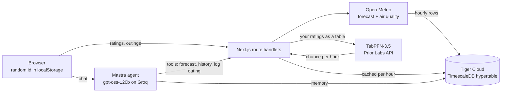

# Nice Out

Weather apps tell everyone the same thing. Nice Out learns what "nice out" means to *you*, then tells you the next window to go outside, so you can close the app and go.

You rate about 14 real hours from your past week ("would you have gone out?"). [TabPFN](https://github.com/PriorLabs/TabPFN), an open tabular foundation model, learns your line from those few rows with no training step, and scores every hour of the next 36. The home screen shows one answer: the next window, how likely you are to enjoy it, and the two or three conditions that matter. Every time you come back from outside you tap Great, Fine or Bad, and that becomes a new training row.

Built for the [Hacktoberfest 2026 Open-Source AI Challenge, Week 1](https://dev.to/challenges/hacktoberfest-week1-2026-10-05) (theme: Touch Grass).

## What it does

- **Quick start.** 14 past hours, picked to cover cool, mild and hot hours at different times of day. Yes or no on each.
- **Next window.** TabPFN gives each upcoming hour a chance that you'll enjoy it. Hours at 60% or more form windows. Night hours (10 pm to 5 am) are never suggested.
- **Reasons in plain words.** "Feels like 25°", "PM2.5 at 18, about the cleanest air of the day", "From 9 am it feels like 31°".
- **Log an outing.** Great, Fine or Bad, with when you were out. The app also stores the chance it showed for that hour *before* you went, so its score is honest.
- **How well it knows you.** Once you've logged 5 real outings, it shows how many it called right, next to a generic "feels like 16–30°, dry, clean air" rule. Before that, it runs a 2-fold holdout on your quick-start ratings.
- **Ask about a plan.** A [Mastra](https://mastra.ai) agent on an open-weight model (`openai/gpt-oss-120b` on Groq) answers things like "when can I do a 1-hour run tomorrow?" using your personal forecast, your history, and a tool to log outings. It remembers lasting facts about you (favourite activity, usual length) in working memory.

## How it works



- **Weather.** Open-Meteo hourly forecast plus 7 past days, and PM2.5 from its air-quality API. Stored per 0.05° map cell (about 5 km) in a TimescaleDB hypertable, refreshed at most once an hour.
- **Model.** Each rating stores the conditions at that hour as features: local hour, feels-like, temperature, humidity, rain chance, rain amount, cloud, wind, UV, daylight, PM2.5. TabPFN fits on your rows and predicts the next 36 hours in one call. The result is cached per hour and per rating count, so each person costs at most one prediction per hour.
- **Agent.** Mastra `Agent` with three tools and `@mastra/pg` memory in the same Tiger database.
- **Privacy.** No accounts and no email. Your location is rounded to about 5 km before it's stored.

## Run it

You need Node 20+, pnpm, and three free keys (none ask for a card):

| Variable | Where |
|---|---|
| `TABPFN_TOKEN` | [Prior Labs](https://priorlabs.ai): 5M tokens a day free |
| `GROQ_API_KEY` | [Groq console](https://console.groq.com) |
| `DATABASE_URL` | [Tiger Cloud](https://www.tigerdata.com) free service with the time-series add-on, or any local Postgres |

```bash
pnpm install
cp .env.example .env.local   # fill in the three values
psql "$DATABASE_URL" -f db/schema.sql
pnpm dev
```

On plain Postgres without TimescaleDB, drop the `WITH (tsdb.hypertable, ...)` clause from `db/schema.sql`; everything else works the same.

### Running TabPFN yourself

The deployed demo uses Prior Labs' hosted API because my laptop has no GPU. TabPFN's weights are open, and tables this small (a few dozen rows, 11 columns) run fine on a CPU with the [`tabpfn`](https://pypi.org/project/tabpfn/) Python package. To keep your ratings on your own machine, replace `predictProba` in [`src/lib/tabpfn.ts`](src/lib/tabpfn.ts) with a call to a small local service that does:

```python
from tabpfn import TabPFNClassifier
clf = TabPFNClassifier().fit(X_train, y_train)
proba = clf.predict_proba(X_test)[:, 1]
```

## Project layout

```
db/schema.sql           tables: conditions (hypertable), people, ratings, outlooks
src/lib/weather.ts      Open-Meteo fetch, hourly storage, place search
src/lib/features.ts     feature columns and the generic comparison rule
src/lib/tabpfn.ts       Prior Labs REST client (upload, fit, predict)
src/lib/outlook.ts      windows, reasons, score, caching
src/mastra/             agent, tools, memory
src/components/         Welcome, Quickstart, Home, Ask
design-options/         the three design directions considered
```

## Credits

Weather and air quality: [Open-Meteo](https://open-meteo.com) (CC BY 4.0). Reverse geocoding: [OpenStreetMap Nominatim](https://nominatim.org). Predictions: TabPFN-3.5 by [Prior Labs](https://priorlabs.ai). Icons: [Phosphor](https://phosphoricons.com). Fonts: Clash Display and Satoshi from [Fontshare](https://www.fontshare.com).

## License

MIT
